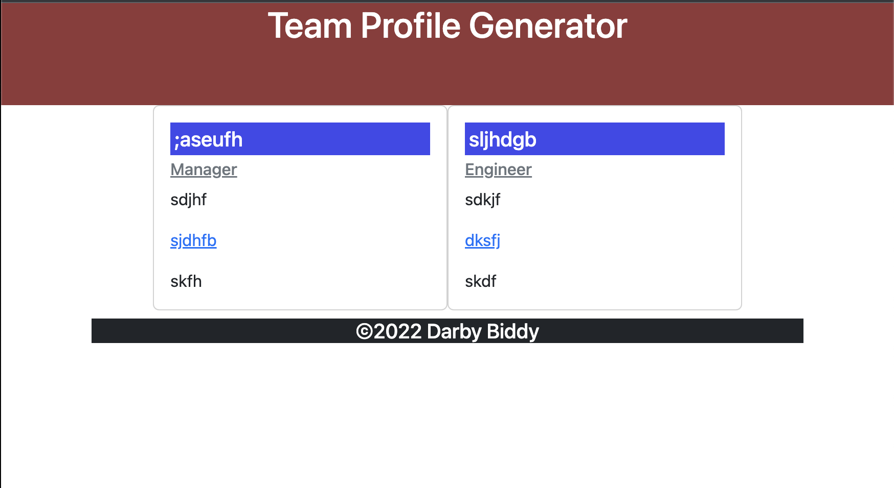

# Team Profile Generator

  
       
  ## Description
  Your challenge is to build a Node.js command-line application that takes in information about employees on a software engineering team and generates an HTML webpage that displays summaries for each person.
  
  ## Table of Contents

  *[Installation](#installation)

  *[Usage](#usage)

  *[License](#license)

  *[Contributing](#contributing)

  *[Test](#test)

  *[Questions](#questions)
  
  
  ## Installation

  npm install
  
  ## Usage

  run node index
  
  ## License
  
  This project is licensed under 

  ## Contributing

  myself and tutors
  
  ## Test

  follow the prompt questions and itll generate the html
  
  ## Questions

To see more of my projects, go to [Darbybiddy](https://github.com/Darbybiddy)
If you have any questions, you can contact me at [darbybiddy3@gmail.com](mailto:darbybiddy3@gmail.com)

